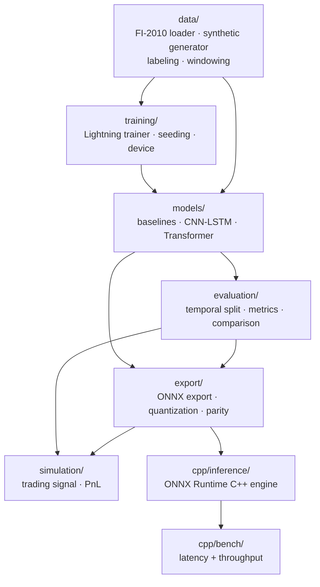

# deeplob-serve

> Deep learning on limit order books: DeepLOB-style CNN-LSTM and Transformer models predict
> short-horizon mid-price moves from LOB data, exported to ONNX and served from a hand-tuned
> C++ inference engine — closing the loop from prediction quality to a trading-signal
> simulation reporting PnL after realistic costs, honestly.

[](https://github.com/wuyutian4071/deeplob-serve/actions/workflows/ci.yml)


**What / Why / Results (30-second version)**

- **What:** an end-to-end ML system on the FI-2010 limit-order-book benchmark — baselines
  (logistic regression, gradient boosting), a DeepLOB-style CNN-LSTM, and a lightweight
  Transformer, evaluated with temporal splits and calibration analysis; the selected model is
  exported to ONNX (dynamically quantized) and served from a C++17 ONNX Runtime inference
  engine with a latency-percentile benchmark harness; predictions are translated into a naive
  trading signal and backtested with realistic transaction costs.
- **Why it's different:** it closes the loop from research to production — quantization, C++
  deployment, and measured latency budgets, not just a notebook with an accuracy number — and
  from prediction quality to economic reality, in the same spirit as
  [statlab](https://github.com/wuyutian4071/statlab)'s real-market results section. Every
  design decision is backed by a committed reason (see [`DESIGN.md`](DESIGN.md)), and several
  genuinely surprising findings survived the process intact rather than being smoothed over —
  most notably that this project's own labeling scheme has a measurable mechanical momentum
  bias (M6), and that batching gives this architecture no throughput benefit at all (M8).
- **Results:** batch-size-1 inference at ~1.3ms P50 (full numbers in
  [`BENCHMARKS.md`](BENCHMARKS.md)); every model lands near chance on this project's
  intentionally signal-free synthetic data — the correct, expected result, not a bug — except
  for one real, traced-to-its-cause exception (see [M6](#comparative-evaluation--calibration-m6));
  the trading simulation loses money after transaction costs, exactly as it should on data
  with no genuine edge (see [M9](#the-trading-signal-simulation-m9)).

## Contents

- [Architecture](#architecture)
- [Status](#status)
- [Quickstart](#quickstart)
- [The data pipeline (M2)](#the-data-pipeline-m2)
- [Baselines and the evaluation harness (M3)](#baselines-and-the-evaluation-harness-m3)
- [Training infra and the CNN-LSTM (M4)](#training-infra-and-the-cnn-lstm-m4)
- [Transformer + ablation sweep (M5)](#transformer--ablation-sweep-m5)
- [Comparative evaluation + calibration (M6)](#comparative-evaluation--calibration-m6)
- [ONNX export + quantization + parity check (M7)](#onnx-export--quantization--parity-check-m7)
- [C++ inference engine + latency/throughput benchmarks (M8)](#c-inference-engine--latencythroughput-benchmarks-m8)
- [The trading-signal simulation (M9)](#the-trading-signal-simulation-m9)
- [License](#license)

## Architecture



`data/` and `training/` are the shared foundation every model consumes. `models/` and
`evaluation/` iterate together across M3-M6 (each new model plugs into the same evaluation
harness). `export/` is the hinge between Python and C++: everything upstream is training and
evaluation, everything downstream (`cpp/inference/`, `cpp/bench/`) consumes only what `export/`
produces. `simulation/` closes the loop on the Python side, independent of the C++ engine.

## Status

Built milestone by milestone, all nine complete.

| Milestone | Scope | State |
|-----------|-------|-------|
| M1 | Repo skeleton, dual CI (Python + C++) | ✅ |
| M2 | Data pipeline: FI-2010 loader + synthetic LOB generator, windowed sequences, labels | ✅ |
| M3 | Baselines (logistic regression, gradient boosting) + temporal-split evaluation harness | ✅ |
| M4 | DeepLOB-style CNN-LSTM + training infra (Lightning, Hydra, MLflow) | ✅ |
| M5 | Transformer baseline + ablation sweeps | ✅ |
| M6 | Comparative evaluation across all models + calibration + published-results comparison | ✅ |
| M7 | ONNX export + quantization + differential parity check | ✅ |
| M8 | C++ inference engine + latency/throughput benchmarks | ✅ |
| M9 | Trading-signal simulation + polished README/DESIGN.md/BENCHMARKS.md | ✅ |

## Quickstart

```bash
# Python
uv sync --all-groups
uv run ruff check src tests
uv run mypy
uv run pytest

# C++
cmake -S cpp -B cpp/build -DCMAKE_BUILD_TYPE=Debug -DENABLE_ASAN=ON -DENABLE_UBSAN=ON
cmake --build cpp/build
ctest --test-dir cpp/build --output-on-failure

# End-to-end pipelines (each trains a fresh model on synthetic data)
uv run python -m deeplob.training.train                 # train + evaluate the CNN-LSTM
uv run python -m deeplob.evaluation.compare              # compare all four models
uv run python -m deeplob.simulation.run_simulation       # trading-signal PnL simulation
make cpp-bench                                           # C++ latency/throughput benchmarks
```

See `make help` for the full list of local commands (mirrors `ci.yml` exactly).

## The data pipeline (M2)

`src/deeplob/data/lob.py` defines this project's LOB feature convention: 40 raw columns (10
price levels, each `[ask_price, ask_volume, bid_price, bid_volume]`). `synthetic.py`'s
`generate_synthetic_lob()` is the deterministic, seeded generator every test and CI run
actually exercises. `labeling.py`'s `compute_labels()` implements the standard FI-2010/DeepLOB
smoothed mid-price-movement scheme; `windowing.py`'s `make_windows()` slides a fixed-length
window over the features, pairing each with the label at its most recent position.
`fi2010.py`'s `load_fi2010()` reads the real dataset's on-disk format (a manual download,
never fetched in CI) and always computes labels via `labeling.py` rather than trusting
FI-2010's own pre-computed ones. See [`DESIGN.md`](DESIGN.md#synthetic-data-structural-validity-no-real-market-realism-claimed)
for why the synthetic generator is a driftless random walk specifically, and
[`DESIGN.md`](DESIGN.md#the-smoothed-labeling-schemes-mechanical-momentum-bias) for a real,
non-obvious property of the labeling scheme discovered in M6.

## Baselines and the evaluation harness (M3)

`evaluation/splits.py`'s `temporal_train_val_test_split()` is the anti-leakage guarantee every
model in this project is built on — see [`DESIGN.md`](DESIGN.md#temporal-splitting-the-anti-leakage-guarantee)
for why chronological-only splitting matters here specifically. `evaluation/metrics.py`'s
`evaluate()` (accuracy, F1 per class, macro F1, confusion matrix) is built once and reused by
every model. `models/baselines.py` provides logistic regression and gradient boosting; the
former is wrapped in a scaling `Pipeline` after a real `ConvergenceWarning` on unscaled raw LOB
features (mixing prices ~100 and volumes ~1-500 on very different scales) — see the findings
table in [`DESIGN.md`](DESIGN.md#findings-the-process-caught).

## Training infra and the CNN-LSTM (M4)

`training/` is the infrastructure every neural model in this project shares: `seeding.py`,
`device.py` (accelerator/precision resolved by actually checking `torch`'s backend, not
assumed), `dataset.py`, and `lightning_module.py`'s `LOBClassifier` — a generic training loop
any classifier `nn.Module` plugs into. `models/cnn_lstm.py`'s `DeepLOBCNNLSTM` follows the
DeepLOB paper's key structural ideas without claiming byte-exact reproduction — see
[`DESIGN.md`](DESIGN.md#the-cnn-lstm-structural-fidelity-not-byte-exact-reproduction).
`training/train.py` is the Hydra config-driven entry point tying together data, training, and
evaluation with local MLflow tracking. Running it on synthetic data surfaces the expected,
honest result: training accuracy climbs well above validation/test accuracy, which lands right
around chance (~33%, three classes) — exactly what should happen on data with no real
predictive signal by construction, confirming the training mechanics work without the model
spuriously "cheating."

## Transformer + ablation sweep (M5)

`models/transformer.py`'s `LOBTransformer` is M5's alternative — mean pooling over time
instead of the CNN-LSTM's final-hidden-state approach; see
[`DESIGN.md`](DESIGN.md#the-transformer-mean-pooling-not-a-final-hidden-state) for why. It
plugs into the exact same `LOBClassifier` training loop with zero changes to `training/`,
confirming M4's model-agnostic design actually holds. `configs/model/` is a proper Hydra
config group (`cnn_lstm.yaml` / `transformer.yaml`) — the model is swappable from the command
line or swept across without touching `config.yaml`.

A 6-way ablation sweep (model × label horizon) ran via `--multirun model=cnn_lstm,transformer
data.horizon=5,10,20`:

| Model | Horizon | Accuracy | Macro F1 | Note |
|-------|---------|----------|----------|------|
| CNN-LSTM | 5 | 0.351 | 0.324 | |
| CNN-LSTM | 10 | 0.350 | 0.347 | |
| CNN-LSTM | 20 | 0.336 | 0.300 | |
| Transformer | 5 | 0.341 | 0.276 | |
| Transformer | 10 | 0.329 | 0.196 | STATIONARY F1 = 0.0 — collapsed to never predicting it |
| Transformer | 20 | 0.367 | 0.265 | STATIONARY F1 = 0.0 — same collapse |

Every combination lands at chance, the expected result on this synthetic data. One genuine
finding did surface, though: at horizons 10 and 20, the Transformer collapsed to predicting
only DOWN/UP under a short (3-epoch) training budget, while the CNN-LSTM showed no such
collapse at any horizon — a real, if likely under-training-driven, robustness difference that
fed directly into M6's model-selection decision.

## Comparative evaluation + calibration (M6)

`evaluation/compare.py` fits/trains and evaluates all four models this project has built
against the exact same synthetic dataset and split, adding calibration analysis
(`brier_score()`/`calibrate()`) and probability-collection support neither M3-M5 needed:

| Model | Accuracy | Macro F1 | Brier | ECE |
|-------|----------|----------|-------|-----|
| Logistic regression | 0.574 | 0.524 | 0.539 | 0.045 |
| Gradient boosting | 0.381 | 0.242 | 0.674 | 0.078 |
| CNN-LSTM | 0.337 | 0.333 | 1.047 | 0.465 |
| Transformer | 0.328 | 0.276 | 0.774 | 0.226 |

**This does not continue the "everything lands at chance" story** — logistic regression
scored 57.4% accuracy, consistently across train/val/test, which was worth tracing rather than
writing off. The cause — a genuine, structural property of this project's smoothed labeling
scheme applied to a random walk, not a bug — is documented in full in
[`DESIGN.md`](DESIGN.md#the-smoothed-labeling-schemes-mechanical-momentum-bias). The practical
implication stated there applies directly to any future real-data validation: check for this
exact artifact before trusting an above-chance score as genuine skill.

**Model selection for M7 (ONNX export) and M8 (C++ inference): the CNN-LSTM**, chosen on
architecture and robustness grounds, explicitly not because it scored highest — see
[`DESIGN.md`](DESIGN.md#model-selection-for-deployment-architecture-and-robustness-not-score).
Comparison against published FI-2010 results is deferred until real FI-2010 data is actually
run through this same harness — a documented manual step, not fabricated numbers.

## ONNX export + quantization + parity check (M7)

`export/onnx_export.py` exports the CNN-LSTM to ONNX and applies onnxruntime's dynamic
quantization; `export/parity.py` runs the same input through PyTorch, the exported ONNX model,
and the quantized ONNX model, reporting how far each optimized path diverges from the PyTorch
reference — the same "verify the optimized path against a trusted reference" discipline
established in the sibling **liquibook-x** project. Two real findings from actually building
this: the export has a **fixed batch size**, not dynamic (a genuine ONNX-exporter limitation,
not a bug — see [`DESIGN.md`](DESIGN.md#onnx-export-a-fixed-batch-size-not-dynamic)), and
quantized-vs-PyTorch numerical parity differs by a real, measured ~60-90× **across platforms**
(macOS ARM64 vs. Linux x86_64) — see
[`DESIGN.md`](DESIGN.md#quantization-pre-processing-and-a-real-cross-platform-tolerance-gap)
for the full explanation and how the test tolerance was set from both platforms' actual
behavior, not loosened blindly.

## C++ inference engine + latency/throughput benchmarks (M8)

`cpp/inference/inference_engine.{hpp,cpp}`'s `InferenceEngine` wraps an ONNX Runtime C++
session for the model M7 exports. `cpp/bench/latency_histogram.hpp` is liquibook-x's own
`bench/latency_histogram.hpp`, mirrored directly. Full methodology and every number are in
**[`BENCHMARKS.md`](BENCHMARKS.md)**; headline results:

```
InferenceEngine::infer (b=1)  n=500  mean=1338.3µs  p50=1292.2µs  p90=1475.4µs  p99=1969.1µs  p99.9=2321.8µs  max=4593.0µs

batch_size=1   throughput=  749.0 rows/sec
batch_size=8   throughput=  750.6 rows/sec
batch_size=32  throughput=  758.6 rows/sec
batch_size=64  throughput=  714.1 rows/sec
```

**Batching provides essentially no throughput benefit here** — stated plainly, with the likely
explanation (single-threaded execution plus the LSTM's inherently sequential computation) in
`BENCHMARKS.md`. Three real findings from actually building and running this — ONNX Runtime's
`Session::Run()` not being `const`, RPATH needing explicit setup on both platforms, and
benchmarks-vs-sanitizers being a genuinely unsupported combination (confirmed, not assumed,
matching liquibook-x's own established pattern) — are documented in
[`DESIGN.md`](DESIGN.md#the-c-inference-engine-const-correctness-rpath-sanitizers-vs-benchmarks).

## The trading-signal simulation (M9)

`simulation/pnl.py` translates model predictions into the simplest possible position — short
on DOWN, flat on STATIONARY, long on UP, no sizing — and computes PnL against the real
synthetic mid-price series with a proportional transaction cost charged on every position
change. `simulation/run_simulation.py` runs this end to end: trains the CNN-LSTM, predicts on
the held-out test set, and reports gross vs. net PnL. See
[`DESIGN.md`](DESIGN.md#the-trading-signal-simulation-a-naive-translation-honest-costs) for
the design reasoning.

```
steps:      2984
trades:     448
gross PnL:  -0.033912
total cost: 0.476000
net PnL:    -0.509912
```

**The strategy loses money — before *and* after transaction costs — exactly as it should.**
Every earlier milestone (M4-M6) already established this synthetic data has no genuine
predictive signal; a naive signal built on top of a model with no real edge losing money once
realistic trading friction (448 trades at 10bps each) is applied isn't a surprise requiring
explanation, it's the same honest finding holding under one more, more economically meaningful
lens — closing the loop from prediction quality to economic reality, in the same spirit as
[statlab](https://github.com/wuyutian4071/statlab)'s own real-market results section. A
strategy that *did* show a profit here, on data mathematically guaranteed to have no
exploitable structure, would be the finding actually requiring investigation — most likely
into a bug, not a discovery.

## License

MIT — see [LICENSE](LICENSE).
